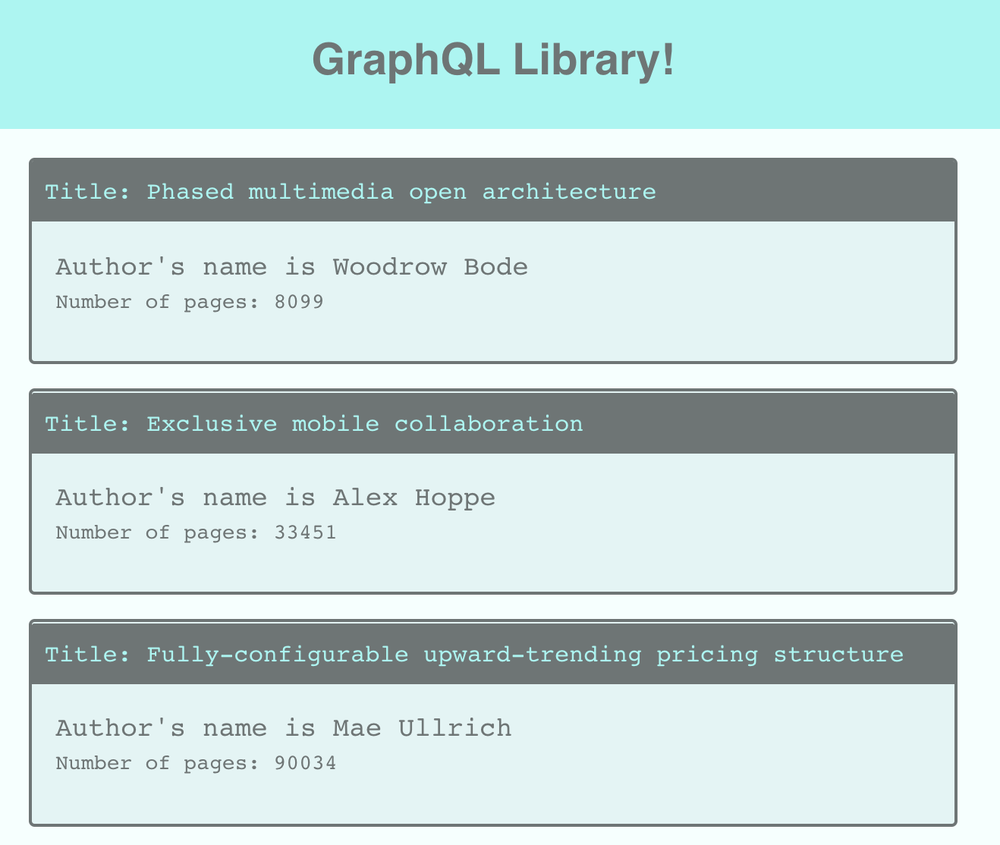

# graphql-books

A MERN stack application using GraphQL for browsing through books.



|                                         |                                         |                                                   |
| :-------------------------------------: | :-------------------------------------: | :-----------------------------------------------: |
|     [Introduction](#graphql-books)      | [Table of Contents](#table-of-contents) | [Development Highlights](#development-highlights) |
|      [Installation](#installation)      |  [Page Description](#page-description)  |       [Code Hightlights](#code-highlights)        |
| [Technologies Used](#Technologies-Used) |           [Credits](#Credits)           |                [License](#License)                |

## Development Highlights

- Set up apollo server
- Connect mongoose to server
- Use queries and mutations on GraphQL

## Installation

Install dependencies.

```
npm i
```

Seed the database

```
npm run seed
```

Start app.

```
npm start
```

## Page Description

A client directory is used for the frontend with React. The client contains the src directory, which contains the components for the app, the pages, and the utils.

The backend is in the server directory. The app is connected to the database in the config folder. The models folder containts the book molders. The schemas folder contains the resolvers and typeDefs for GraphQL. The seed information uses faker to create random information. The server is created in server.js

The package.json at the root of the app is used to start the application.

## Code Highlights

Set up apollo server.

```JavaScript
async function startApolloServer() {
    const server = new ApolloServer({
        typeDefs,
        resolvers,
    });
    await server.start();

    const app = express();

    server.applyMiddleware({ app });
    app.use(express.urlencoded({ extended: false }));
    app.use(express.json());

    db.once('open', () => {
        console.log('DB is live');
        app.listen(PORT, () => {
            console.log(`App is running on ${PORT}`);
            console.log(`The graphQL PLAYGROUND that is configured here http://localhost:${PORT}${server.graphqlPath}`)
        })
    })
}
```

Defining typeDefs of the book.

```JavaScript
const typeDefs = gql`
    type Book {
        _id: ID
        title: String
        author: String
        pages: Int
    }
    type Query {
        books: [Book]
        book(title: String!): Book
    }

    type Mutation {
        addBook(title: String!, author: String!, pages: Int!): Book
    }
`
```

## Technologies Used

### Backend Language

- [Node.js](https://nodejs.org/en/)

### Query Language

- [GraphQL](https://graphql.org/)

### Database

- [Mongodb](https://mongoosejs.com/)

### NPM Dependencies

- [concurrently](https://www.npmjs.com/package/concurrently)

### Frontend Framework

- [React](https://reactjs.org/)

## Credits

|                           |                                                                                                                                                                                                       |
| ------------------------- | ----------------------------------------------------------------------------------------------------------------------------------------------------------------------------------------------------- |
| **David Anusontarangkul** | [ LinkedIn](https://www.linkedin.com/in/anusontarangkul/) [ GitHub](https://github.com/anusontarangkul) |

## License

[](https://opensource.org/licenses/MIT)
